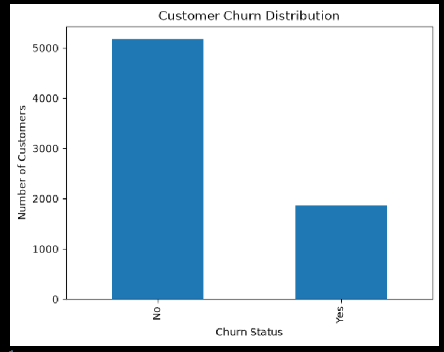
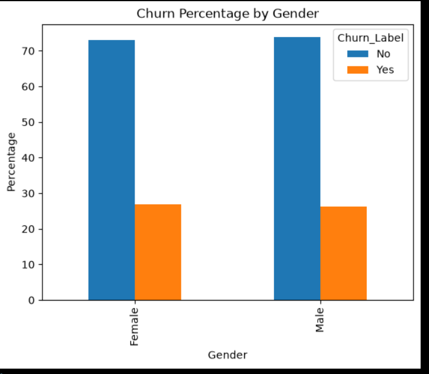
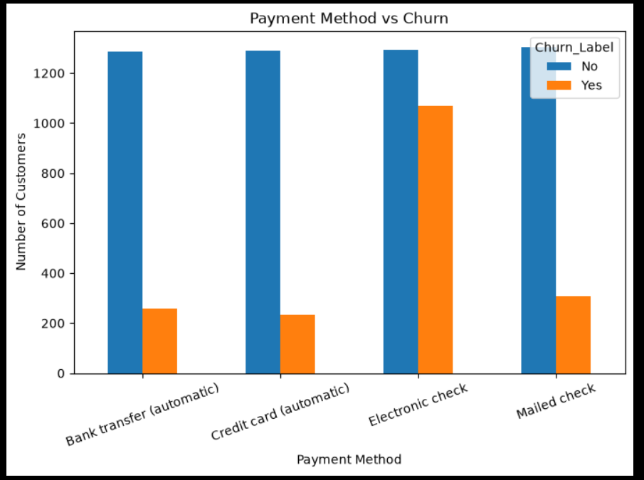
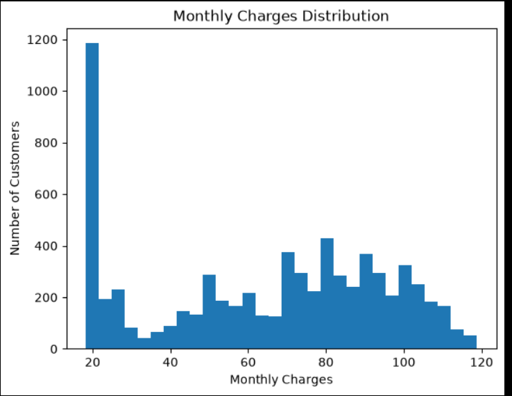
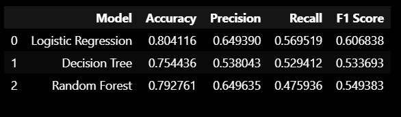
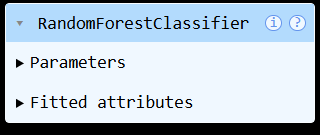

# 📊 Customer Churn Prediction using Machine Learning

An end-to-end Machine Learning project that predicts whether a customer is likely to churn (leave a telecom service) based on customer demographics, subscription details, and billing information.

This project demonstrates the complete Machine Learning workflow, from business understanding to model building and evaluation.

---

# 🎯 Project Objective

Customer churn is one of the biggest challenges faced by telecom companies. This project aims to build a predictive model that helps identify customers who are likely to leave the service, allowing businesses to take proactive retention measures.

---

# 🚀 Machine Learning Workflow

This project follows the complete Machine Learning Lifecycle:

- ✅ Business Understanding
- ✅ Data Understanding
- ✅ Data Cleaning
- ✅ Exploratory Data Analysis (EDA)
- ✅ Feature Engineering
- ✅ Model Building
- ✅ Model Evaluation
- ✅ Model Comparison
- ✅ Model Saving

---

# 📂 Project Structure

```text
customer-churn-prediction/
│
├── data/
│   ├── raw/
│   └── processed/
│
├── images/
│   ├── churn_distribution.png
│   ├── churn_by_gender.png
│   ├── contract_vs_churn.png
│   ├── internet_vs_churn.png
│   ├── payment_method_vs_churn.png
│   ├── monthly_charges.png
│   ├── model_comparison.png
│   └── random_forest.png
│
├── models/
│   └── random_forest_model.pkl
│
├── notebooks/
│   ├── 01_Business_Understanding.ipynb
│   ├── 02_Data_Understanding.ipynb
│   ├── 03_Data_Cleaning.ipynb
│   ├── 04_Exploratory_Data_Analysis.ipynb
│   ├── 05_Feature_Engineering.ipynb
│   ├── 06_Model_Building.ipynb
│   ├── 07_Model_Optimization.ipynb
│   ├── 08_Model_Interpretation.ipynb
│   └── 09_Final_Conclusion.ipynb
│
├── README.md
├── requirements.txt
└── LICENSE
```

---

# 📁 Dataset

**Dataset:** Telco Customer Churn Dataset

The dataset contains customer information such as:

- Gender
- Senior Citizen
- Partner
- Dependents
- Tenure
- Internet Service
- Contract Type
- Payment Method
- Monthly Charges
- Total Charges
- Customer Churn

---

# 🛠 Technologies Used

- Python
- Pandas
- NumPy
- Matplotlib
- Scikit-learn
- Jupyter Notebook
- Git
- GitHub

---

# 🤖 Machine Learning Models

The following Machine Learning models were trained and evaluated:

- Logistic Regression
- Decision Tree Classifier
- Random Forest Classifier

---

# 🏆 Best Performing Model

Among all the trained models, **Random Forest Classifier** achieved the best overall performance based on:

- Accuracy
- Precision
- Recall
- F1 Score

The trained model has been saved as:

```text
models/random_forest_model.pkl
```

---

# 📊 Evaluation Metrics

The models were evaluated using:

- Accuracy
- Precision
- Recall
- F1 Score

---

# 📈 Exploratory Data Analysis

## Churn Distribution



---

## Churn by Gender



---

## Contract vs Churn


---

## Internet Service vs Churn


---

## Payment Method vs Churn



---

## Monthly Charges Distribution



---

# 📊 Model Results

## Model Comparison



---

## Random Forest Model



---

# 💡 Business Impact

This predictive model can help telecom companies:

- Identify customers who are likely to churn.
- Improve customer retention strategies.
- Reduce customer acquisition costs.
- Increase customer lifetime value.
- Support data-driven business decisions.

---

# 🚀 Future Improvements

- Deploy the model using Streamlit
- Build an interactive Power BI Dashboard
- Add Explainable AI (SHAP)
- Perform Hyperparameter Optimization
- Deploy using Docker
- Integrate with a cloud platform

---

# ▶️ How to Run the Project

Clone the repository:

```bash
git clone https://github.com/sejalsingh29/customer-churn-prediction.git
```

Go to the project folder:

```bash
cd customer-churn-prediction
```

Install the required libraries:

```bash
pip install -r requirements.txt
```

Run the notebooks using Jupyter Notebook.

---

# 📄 License

This project is licensed under the **MIT License**.

---

# 👩‍💻 Author

**Sejal Singh**

M.Sc. Data Analytics Student

GitHub: https://github.com/sejalsingh29

---

⭐ If you found this project useful, consider giving it a Star on GitHub!